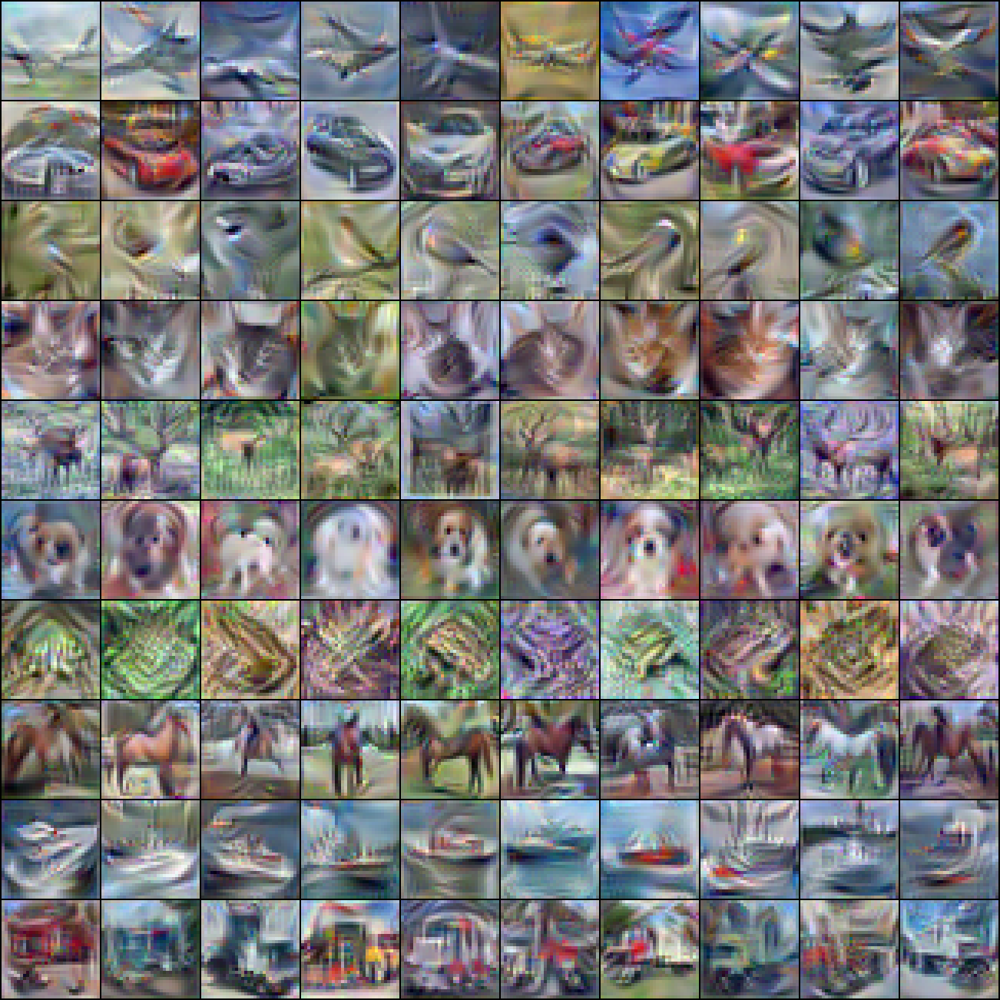
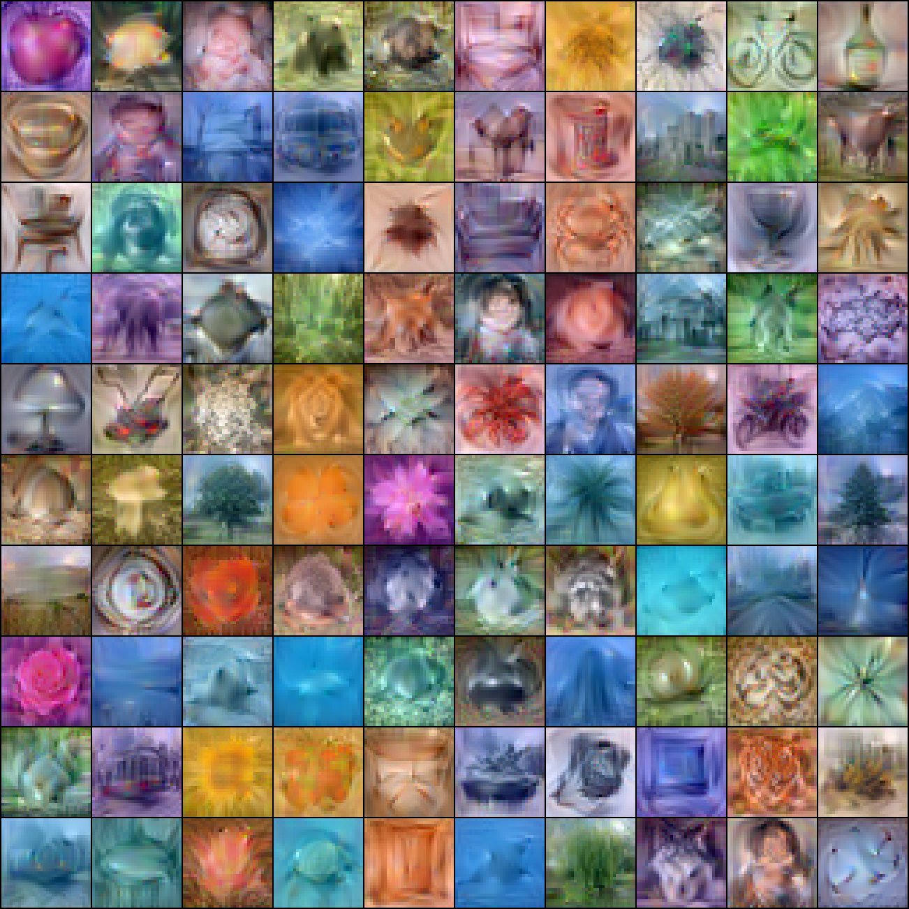
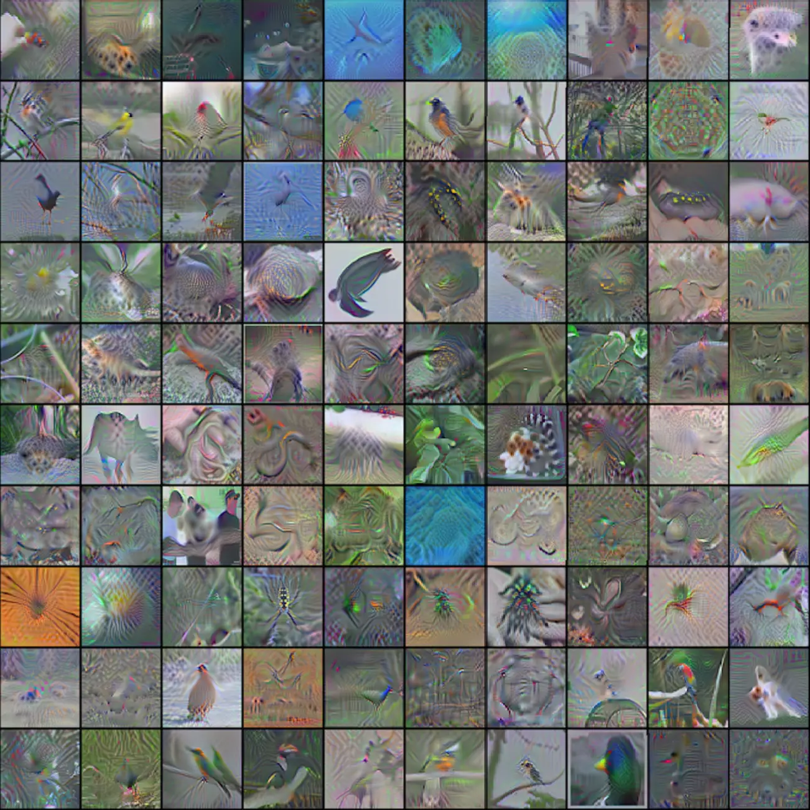

# Scaling Up Dataset Distillation to ImageNet-1K with Constant Memory (TESLA)
Hello!!! Thanks for checking out our [repo](https://github.com/justincui03/tesla) and [paper](https://arxiv.org/abs/2211.10586)! 🍻


## Setup
Clone our codebase by following the command below
```
git clone https://github.com/justincui03/tesla.git
``` 

Then install the required environments
```
cd tesla
conda env create -f requirements.yaml
```
Please make sure to activate the environtment before starting any of the following commands by 
```
conda activate tesla
```

## Generating Expert Trajectories
Our method is developed based on MTT, therefore we follow its general workflow. The first step is to generate the expert trajectories by following the command below
```
python buffer.py --dataset=CIFAR10 --model=ConvNet --train_epochs=50 --num_experts=100 --zca
```

The command we used to generate ImageNet-1K trajectories is 
```
python buffer.py --dataset=ImageNet --model=ConvNetD4 --train_epochs=50 --num_experts=50
```
In order to download the **ImageNet** dataset, please follow the steps [here](https://www.image-net.org/download.php)

## Running TESLA
Below are the a few example commands to get started.
### CIFAR-10
```
python distill.py --dataset=CIFAR10 --ipc=1 --syn_steps=50 --expert_epochs=2 --max_start_epoch=5 --lr_img=1000 --lr_lr=1e-07 --lr_teacher=0.01
```
### CIFAR-100
```
python distill.py --dataset=CIFAR100 --ipc=50 --syn_steps=80 --expert_epochs=2 --max_start_epoch=40 --lr_img=1000 --lr_lr=1e-05 --lr_teacher=0.01 --batch_syn=125  --zca
```
### ImageNet-1K
```
python distill.py --dataset=ImageNet --ipc=1 --syn_steps=10 --expert_epochs=3 --max_start_epoch=10 --lr_img=10000 --lr_lr=1e-04 --lr_teacher=0.01 --batch_syn=100 --model=ConvNetD4 --teacher_label
```

## Overall Architecture


## Example Synthesized Images
<div>
  
   
  
  <!-- <p style="width:32%;float:left;min-width:100px;text-align:center"> -->
  <!-- CIFAR-10 </p> -->
  <!-- <p style="width:32%;float:left;min-width:100px;text-align:center">CIFAR-100 </p>
  <p style="width:32%;float:right;min-width:100px;text-align:center">ImageNet-1K </p> -->
</div>
                           


## Acknowledgments
Our code is developed based on the following codebases, thanks for sharing
* [Dataset Distillation](https://github.com/SsnL/dataset-distillation)
* [Dataset Distillation by Matching Training Trajectories](https://github.com/GeorgeCazenavette/mtt-distillation)
* [Dataset Condensation with Differentiable Siamese Augmentation](https://github.com/VICO-UoE/DatasetCondensation)
* [Dataset Distillation using Neural Feature Regression](https://github.com/yongchao97/FRePo)
* [Flexible Dataset Distillation: Learn Labels Instead of Images](https://github.com/ondrejbohdal/label-distillation)

**👍 Special thanks to Bo Zhao, 
George Cazenavette and Mingyang Chen for their valuable feedback.**

# Reference
If you find our code useful for your research, please cite our paper.
```
@inproceedings{cui2023scaling,
  title={Scaling up dataset distillation to imagenet-1k with constant memory},
  author={Cui, Justin and Wang, Ruochen and Si, Si and Hsieh, Cho-Jui},
  booktitle={International Conference on Machine Learning},
  pages={6565--6590},
  year={2023},
  organization={PMLR}
}
```


